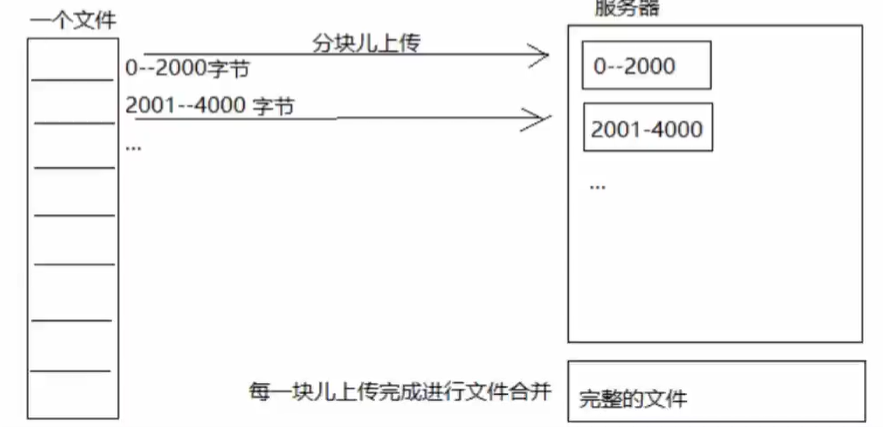

# <center>🎉 在线视频项目 🎉</center>

<hr/>

## 1.技术难点：

### 树节点构造：

- 课程信息分类树
- 评论树

### 事务失效问题：

- @Transactional 注解使用 <br>

<P>
    避免使用 @Transactional 在一个方法内使用网络调用。因为通常情况下如果出现网络调用时延过长的情况，数据库在开启事务之后，数据库会维持当前数据库连接
，长时间的占用数据库资源，极端情况可能会导致数据资源不够的情况。
</p>

- @Transactional 注解失效 <br>

<p>
    方法上已经添加了 @Transactional 注解为什么不能被事务控制？<br>
    一个非事务方法调用同一个类一个事务方法，事务无法控制，这是为什么？<br>
    通常我们使用Controller层调用Service层进行业务处理，这时我们一般使用的是 @Autowired 注入的Service层接口，通过使用 @Autowired 注解注入的都是代理对象。<br>
    此时，我们如果直接调用方法是通过代理对象调用非事务方法，然后在非事务方法中由原本实例对象调用事务方法（非代理对象调用事务方法），此时非代理对象并没开启事务，
    所以非事务方法执行过程中在异常情况下并不会执行回滚。
</p>

<p>
    解决方案：自己把自己进行注入，然后通过自己（生成一个自己的代理对象）调用这个事务方法，使用代理对象调用事务方法，就能避免事务失效的情况。
</p>

<p>
    PS：这里需要去了解一下事务的 <strong>传播行为</strong> ！！！
</p>

### 大文件上传：
- 断点续传：

<p>
    通常情况下视频文件比较大，而HTTP协议虽然本身对于传输的文件大小并没有限制，但是可能由于客户端网络情况造成传输失败的情况，如果失败后需要用户重新上传
    ，对于用户体验来说是十分糟糕的，所以对于大型的媒体资源的上传需要支持断点续传。    
</p>

<p>
    断点续传是指在上传和下载时，将上传和下载任务（一个文件或者压缩包）人为的划分为几个部分，每个部分采用一个线程进行上传和下载。如果过程中碰到网络故障，
    可以从已经上传或者下载的部分开始继续上传或者下载未完成的部分，而没有必要从头开始上传和下载，节省操作时间，提高用户体验。
</p>



<p>

<strong>分块上传流程：</strong>
 
1. 前端上传前先把文件分成块
2. 一块一块的上传文件块（多次调用后端接口，有几个分块调用几次接口），上传中断后重新上传，已上传的分块不用再上传
3. 各个分块上传完成，最后在服务端合并文件

<strong>后端处理分块上传逻辑：</strong>

1. 先进行数据库文件信息校验，如果数据库信息存在，则通过获取到的数据库信息对对象存储服务器上的文件信息进行校验（判断文件是否存在）
2. 对文件的分块信息进行校验（分块存放在对象存储服务器中）
3. 封装文件对象信息，调用对象存储上传接口，上传文件。
4. 上传成功后，对文件信息进行数据校验，校验完成之后，将文件信息记录到数据库中
5. 对象存储文件中的文件需要进行合并

</p>

<hr/>

## 2.工程模块设计：

### 技术选选型：

前端：

- TypeScript
- Vue
- Element UI


后端：
- Spring、Spring MVC、Spring Boot
- MyBatis、MyBatisPlus
- MySQL

### 工程模块：

#### CSBox Parent

整个项目父工程模块，定义所有的依赖项

#### CSBox Base

项目基础配置模块，包含项目的全局常量配置、全局异常处理、全局在线API文档配置、跨域问题处理

#### CSBox Gateway

项目服务网关，使用Spring Cloud gateway组件

#### CSBox Content

课程信息模块，包含对课程信息的CRUD业务

#### CSBox Media

媒体资源模块，包含对媒体资源的CRUD业务


<hr/>


## 3.数据库模块设计：

### 课程信息模块：

#### csbox-video-content

- course-base：课程视频基础信息表

```SQL
-- 课程基本信息 
-- auto-generated definition
create table course_base
(
    id            bigint auto_increment comment '主键'
        primary key,
    company_id    bigint                  not null comment '机构ID',
    company_name  varchar(255)            null comment '机构名称',
    name          varchar(100)            not null comment '课程名称',
    users         varchar(500)            null comment '适用人群',
    tags          varchar(50)             null comment '课程标签',
    mt            varchar(20)             not null comment '大分类',
    st            varchar(20)             not null comment '小分类',
    grade         varchar(32)             not null comment '课程等级',
    teachmode     varchar(32)             not null comment '教育模式(common普通，record 录播，live直播等）',
    description   text                    null comment '课程介绍',
    pic           varchar(500)            null comment '课程图片',
    create_date   datetime                null comment '创建时间',
    change_date   datetime                null comment '修改时间',
    create_people varchar(50)             null comment '创建人',
    change_people varchar(50)             null comment '更新人',
    audit_status  varchar(10)             not null comment '审核状态',
    status        varchar(10) default '1' not null comment '课程发布状态 未发布  已发布 下线'
)
    comment '课程基本信息' charset = utf8mb3;
```

- course-category：课程视频分类信息表

```sql
-- 课程分类 
-- auto-generated definition
create table course_category
(
    id       varchar(20)             not null comment '主键'
        primary key,
    name     varchar(32)             not null comment '分类名称',
    label    varchar(32)             null comment '分类标签默认和名称一样',
    parentid varchar(20) default '0' not null comment '父结点id（第一级的父节点是0，自关联字段id）',
    is_show  tinyint                 null comment '是否显示',
    orderby  int                     null comment '排序字段',
    is_leaf  tinyint                 null comment '是否叶子'
)
    comment '课程分类' charset = utf8mb3;
```

使用 `parentid` 来维护树形结构，指向父级Id（同理：评论树的实现）。当树型结构比较固定时，可以使用表的自连接进行树形结构的查询；当树的结构不固定时
可以使用MySQL8的新特性递归with语法，查询树形结构。

```sql
--- 递归查询
with recursive treeNode as (select *
                            from course_category
                            where id = '1'
                            union all
                            select category.*
                            from course_category as category
                                     inner join treeNode
                                                on treeNode.id = category.parentid)
select *
from treeNode
order by treeNode.id;
```
- course_market：课程营销信息表

```sql
-- 课程营销信息 
-- auto-generated definition
create table course_market
(
    id             bigint       not null comment '主键，课程id'
        primary key,
    charge         varchar(32)  not null comment '收费规则，对应数据字典',
    price          float(10, 2) null comment '现价',
    original_price float(10, 2) null comment '原价',
    qq             varchar(32)  null comment '咨询qq',
    wechat         varchar(64)  null comment '微信',
    phone          varchar(32)  null comment '电话',
    valid_days     int          null comment '有效期天数'
)
    comment '课程营销信息' charset = utf8mb3;
```

### 媒体资源信息模块：

#### csbox-video-media

- media-files：媒体资源信息表

```sql
-- 媒资信息 
-- auto-generated definition
create table media_files
(
    id           varchar(32)             not null comment '文件id,md5值'
        primary key,
    company_id   bigint                  null comment '机构ID',
    company_name varchar(255)            null comment '机构名称',
    filename     varchar(255)            not null comment '文件名称',
    file_type    varchar(12)             null comment '文件类型（图片、文档，视频）',
    tags         varchar(120)            null comment '标签',
    bucket       varchar(128)            null comment '存储目录',
    file_path    varchar(512)            null comment '存储路径',
    file_id      varchar(32)             not null comment '文件id',
    url          varchar(1024)           null comment '媒资文件访问地址',
    username     varchar(60)             null comment '上传人',
    create_date  datetime                null comment '上传时间',
    change_date  datetime                null comment '修改时间',
    status       varchar(12) default '1' null comment '状态,1:正常，0:不展示',
    remark       varchar(32)             null comment '备注',
    audit_status varchar(12)             null comment '审核状态',
    audit_mind   varchar(255)            null comment '审核意见',
    file_size    bigint                  null comment '文件大小',
    constraint unique_fileid
        unique (file_id) comment '文件id唯一索引 '
)
    comment '媒资信息' charset = utf8mb3;
```